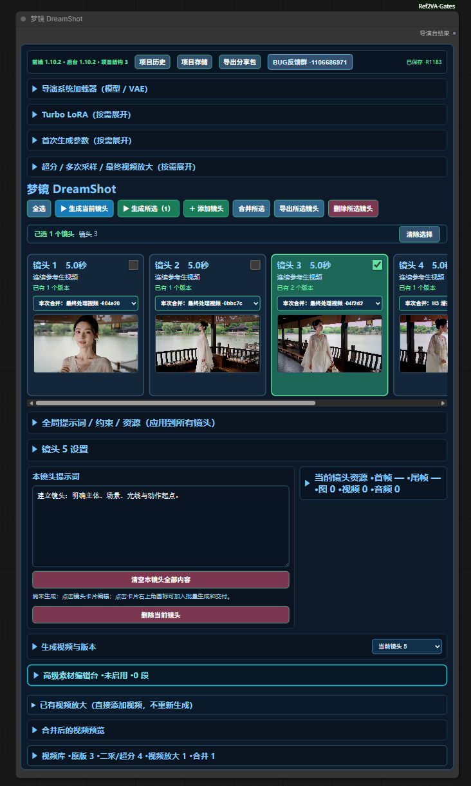

# 梦镜 DreamShot

面向 ComfyUI / MiniMax H3 的视频导演工作台：把多镜头剧本、参考素材、采样与超分放大、视频库和成片合并整合进一个可视化工作流。

## 功能介绍

- **DreamShot 统一导演工作台**（`Ref2VAUnifiedDirectorStudio` / `Ref2VAUnifiedDirectorRunner`）
  - 多镜头（连续分镜）管理：逐镜头提示词、参考图 / 视频 / 音频、首帧 / 尾帧素材。
  - 首次生成（第一采）、二次采样 / 多次采样、H3 Latent 超分；主采样条件一致时自动复用原版 latent，只执行二采 / 超分 / 放大。
  - 已有视频放大：NVIDIA RTX 或 TE FlashVSR，支持倍率与质量参数。
  - 四组视频库：原版视频、二采 / H3 超分视频、RTX / TE 视频放大、合并结果；删除先进入项目回收区。
  - 镜头合并（每镜头可单独选择使用版本）、合并成片历史、导出合并清单。
  - 上一镜头尾帧自动接续（tail-frame handoff）。
- **Ref2VA 参考门控节点**：图片 / 视频 / 音频参考开关、参考区域开关、多参考总开关（`Ref2VAImageGate`、`Ref2VAAudioGate`、`Ref2VARegionSwitchboard`、`Ref2VAWithGlobalGates`、`Ref2VAAllInOne`）。
- **连续分镜控制台**：3 段分镜提示词面板、分镜视频归档、自动成片归档、上传上一镜头并自动取尾帧。
- **采样控制面板族**：第一次采样、第二次 / N 次采样（旧版）、同分辨率细化模板、H3 Latent 超分模板、二次采样模式选择器、统一多遍采样执行器、最初 / 最终视频输出控制板。
- **模型加载面板**：UNet / CLIP / 视频 VAE / 音频 VAE / Turbo LoRA（`Ref2VAModelLoader`）。
- **其他节点**：解码并创建视频、实时视频预览、RTX 视频放大并保存。

## 功能截图

> 截图待补充，放置到 `docs/images/` 后刷新本文件即可显示。



## 安装方法

### 前置依赖

1. ComfyUI（需包含 MiniMax H3 支持，即存在 `comfy_extras/nodes_minimax_h3.py` 的较新版本）。
2. **配套插件 `ComfyUI_MiniMaxH3_Director`**（必需）：本插件代码直接导入其 `director.h3_latent_upscale` 与 `director.refine_pack` 模块，未安装时 ComfyUI 加载本插件会报错。
3. MiniMax H3 相关模型（基础模型、视频 / 音频 VAE、LoRA 等），以及可选的 H3 Latent 超分模型（默认查找 `minimax_h3_latent_upscaler_3d_bf16.safetensors`）。
4. 可选：TE FlashVSR 节点（`TEFlashVSRModelLoader` / `TEFlashVSRTuning` / `TEFlashVSRRestore`）及对应模型；NVIDIA RTX 放大支持。

### 方法一：ComfyUI Manager / Git URL 安装

仓库公开后，在 ComfyUI Manager 中使用 Git URL 安装本仓库地址即可（仓库根目录即插件目录）。

### 方法二：Git Clone

```bash
cd ComfyUI/custom_nodes
git clone https://github.com/TODO/ComfyUI-DreamShot.git
```

本插件没有超出 ComfyUI 自带范围的额外 pip 依赖，通常无需执行 `pip install -r requirements.txt`（该文件默认全部为注释）。

### 方法三：Release ZIP

下载 Release 中的 `DreamShot-v1.10.1.zip`，解压后将 `ComfyUI-DreamShot` 文件夹放入 `ComfyUI/custom_nodes/`。

安装或升级后启动 ComfyUI，并在浏览器按 `Ctrl + F5` 强制刷新页面。详细步骤见 [docs/使用教程.md](docs/使用教程.md)。

## 使用方法

1. 启动 ComfyUI，确认终端无加载报错。
2. 将 `workflows/DreamShot_v1.10.1.json` 拖入画布（单节点工作流，出现 DreamShot 工作台即加载成功）。
3. 按教程操作：配置镜头与素材 → 首次生成 → 二采 / 超分 / 放大（可选）→ 合并与导出。

完整操作说明见 [docs/使用教程.md](docs/使用教程.md)。

## 工作流

| 文件 | 说明 |
| --- | --- |
| `workflows/DreamShot_v1.10.1.json` | 单节点工作流（`Ref2VAUnifiedDirectorRunner`），依赖本插件与 `ComfyUI_MiniMaxH3_Director`。下载后直接拖入 ComfyUI 画布即可使用。 |

## 更新日志

见 [CHANGELOG.md](CHANGELOG.md)。

## 注意事项

- 节点类名 / 节点 ID（如 `Ref2VAUnifiedDirectorRunner`）保持稳定，旧工作流兼容；插件目录名由 `ComfyUI-Ref2VA-Gates` 改为仓库名 `ComfyUI-DreamShot`，不影响工作流。
- 必须同时安装配套插件 `ComfyUI_MiniMaxH3_Director`（硬依赖）。
- 升级前建议备份旧版插件文件夹与工作流 JSON；本插件不会自动删除历史项目、视频库内容或输出文件。
- 前端更新后若仍显示旧界面，请完全重启 ComfyUI 并 `Ctrl + F5` 强刷。

## License

见 [LICENSE](LICENSE)（TODO：许可证尚未由项目所有者选定）。
